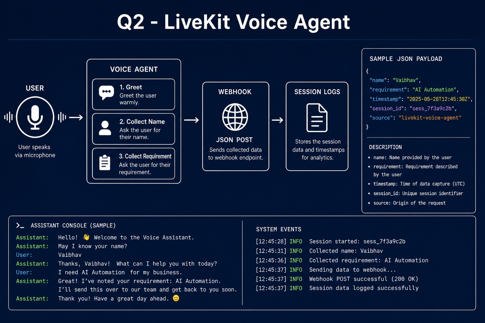
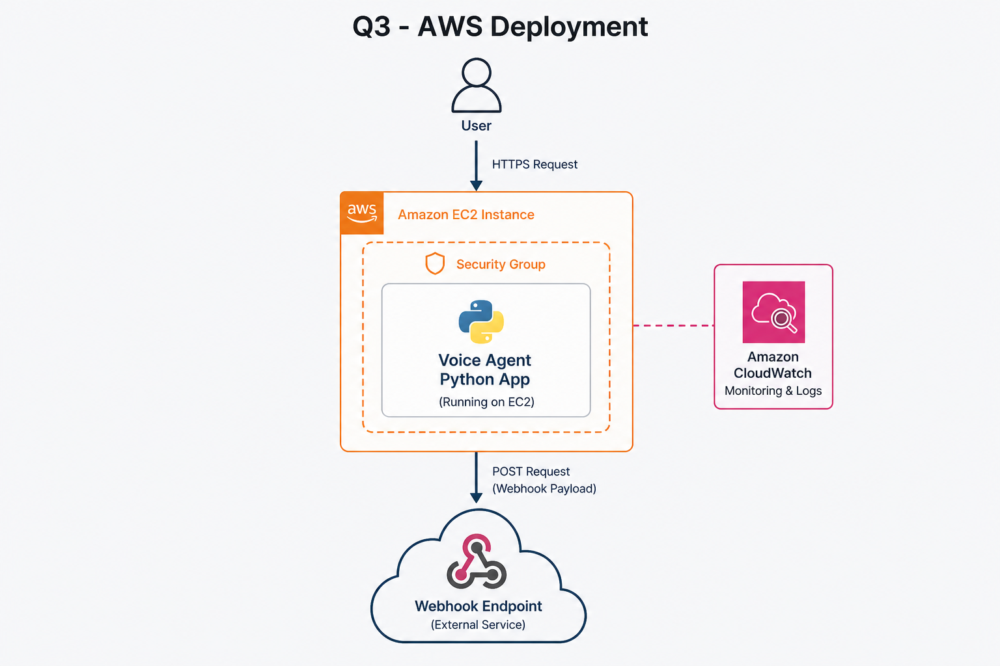
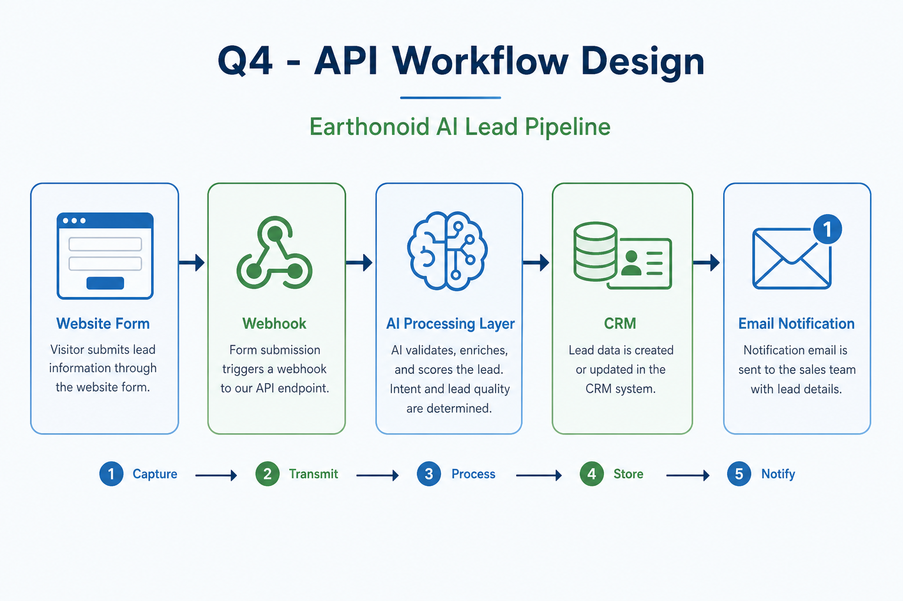
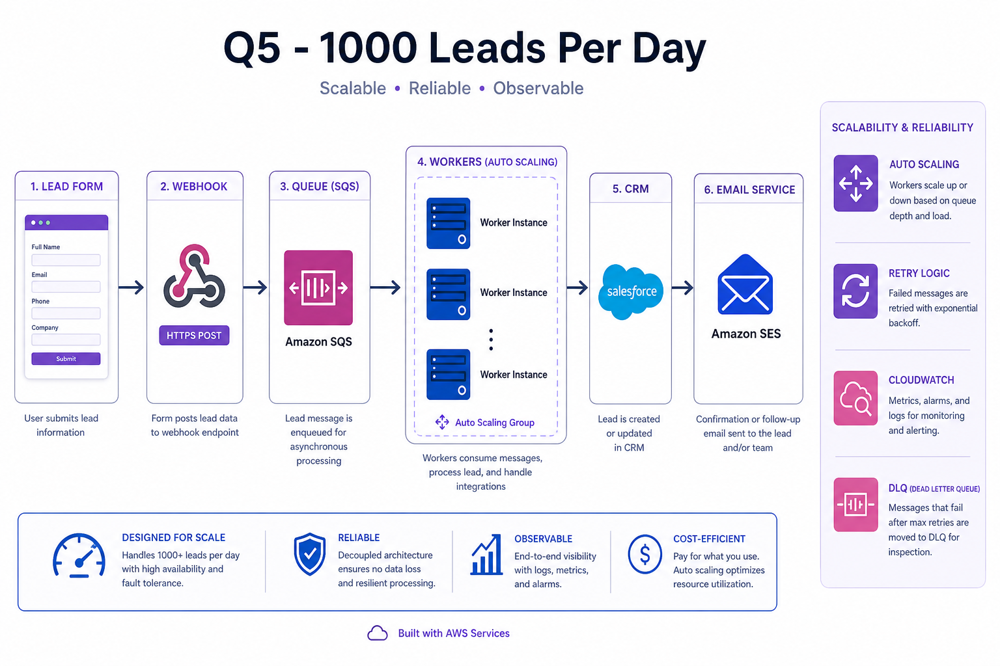

# LiveKit Voice Agent Integration

**Earthonoid AI — AI Automation Developer Internship Assessment**  
**Candidate:** Vaibhav  
**Repository:** [github.com/vaibhav410/LiveKit-Voice-Agent-Integration](https://github.com/vaibhav410/LiveKit-Voice-Agent-Integration)

A production-oriented LiveKit voice agent that greets users, collects name and requirement through conversation, submits structured JSON to a webhook, confirms success, and persists full session logs.

---

## Assignment Coverage

| Question | Topic | Status | Documentation |
|----------|--------|--------|----------------|
| **Q2** | LiveKit Voice Agent Integration | Complete | [Conversation Flow](#q2--livekit-voice-agent-integration) · [`demo/`](demo/) |
| **Q3** | AWS Deployment | Complete | [`docs/Q3_AWS_Deployment.md`](docs/Q3_AWS_Deployment.md) |
| **Q4** | API & Workflow Design | Complete | [`docs/Q4_Workflow_Design.md`](docs/Q4_Workflow_Design.md) |
| **Q5** | Scalability & Problem Solving | Complete | [`docs/Q5_Scalability.md`](docs/Q5_Scalability.md) |

---

## Q2 – LiveKit Voice Agent Integration

### Capabilities demonstrated

| Requirement | Implementation |
|-------------|----------------|
| User greeting | `VoiceAgent.greeting()` |
| Name collection | `VoiceAgent.get_name()` |
| Requirement collection | `VoiceAgent.get_requirement()` |
| Webhook submission | `VoiceAgent.submit_webhook()` via `requests.post` |
| JSON payload generation | `{"name", "requirement", "timestamp"}` |
| Confirmation response | `VoiceAgent.confirm()` |
| Session logging | `sessions/session_*.json` + `sessions/user_data_*.json` |

### Sample conversation

```
Assistant: Hello, welcome to Earthonoid AI.

Assistant: What is your name?

User: Vaibhav

Assistant: What is your requirement?

User: AI Automation

Assistant: Thank you. Your information has been submitted successfully.
```

### Sample payload

```json
{
  "name": "Vaibhav",
  "requirement": "AI Automation"
}
```

Extended production payload (includes timestamp):

```json
{
  "name": "Vaibhav",
  "requirement": "AI Automation",
  "timestamp": "2026-05-31T15:06:43.093834"
}
```

See [`demo/sample_conversation.txt`](demo/sample_conversation.txt) and [`demo/webhook_payload.json`](demo/webhook_payload.json).

### Q2 architecture

```
User (Voice / Input)
        │
        ▼
┌───────────────────┐
│   Voice Agent     │  voice_agent.py
│  Greet → Collect  │
│  → POST webhook   │
└─────────┬─────────┘
          │
    ┌─────┴─────┐
    ▼           ▼
 Webhook    sessions/*.json
```



---

## AWS Deployment (Q3)

Deploy the voice agent on **AWS EC2** with webhook integration:

```
User → AWS EC2 → Voice Agent → Webhook
```

| Topic | Link |
|-------|------|
| EC2 setup, security groups, Python, Git clone | [`docs/Q3_AWS_Deployment.md`](docs/Q3_AWS_Deployment.md) |
| Monitoring & CloudWatch | [Q3 – Monitoring Strategy](docs/Q3_AWS_Deployment.md#monitoring-strategy) |



---

## Workflow Design (Q4)

End-to-end lead processing from form or voice agent to CRM and email:

```
Website Form → Webhook → AI Processing Layer → CRM → Email Notification
```

The voice agent feeds the same webhook layer as a website form.

| Topic | Link |
|-------|------|
| API flow, payloads, CRM mapping | [`docs/Q4_Workflow_Design.md`](docs/Q4_Workflow_Design.md) |
| Retry logic & error handling | [Q4 – Retry & Errors](docs/Q4_Workflow_Design.md#retry-logic) |



---

## Scalability (Q5)

Design for **1,000 leads per day** using queue-based async processing:

```
Lead Form → Webhook → Queue → Workers → CRM → Email Service
```

| Topic | Link |
|-------|------|
| Scaling, SQS, Auto Scaling | [`docs/Q5_Scalability.md`](docs/Q5_Scalability.md) |
| Monitoring, logging, alerting | [Q5 – Operations](docs/Q5_Scalability.md#monitoring) |



---

## Screenshots

| File | Description |
|------|-------------|
| [`screenshots/q2_voice_agent.png`](screenshots/q2_voice_agent.png) | Voice agent conversation and session output |
| [`screenshots/q3_architecture.png`](screenshots/q3_architecture.png) | AWS EC2 deployment architecture |
| [`screenshots/q4_workflow.png`](screenshots/q4_workflow.png) | API & workflow pipeline |
| [`screenshots/q5_scalability.png`](screenshots/q5_scalability.png) | Queue-based scalability architecture |

---

## Repository Structure

```
LiveKit-Voice-Agent-Integration/
├── voice_agent.py              # Main agent: greet, collect, webhook, log
├── webhook_server.py           # Local FastAPI webhook for testing
├── voice_agent_test.py         # Test utilities
├── requirements.txt
├── .env.example
│
├── docs/
│   ├── Q3_AWS_Deployment.md
│   ├── Q4_Workflow_Design.md
│   └── Q5_Scalability.md
│
├── demo/
│   ├── sample_conversation.txt
│   ├── webhook_payload.json
│   └── installation_guide.md
│
├── screenshots/
│   ├── q2_voice_agent.png
│   ├── q3_architecture.png
│   ├── q4_workflow.png
│   └── q5_scalability.png
│
└── sessions/                   # Runtime session logs (JSON)
    ├── session_*.json
    └── user_data_*.json
```

---

## Quick Start

### Prerequisites

- Python 3.8+
- LiveKit Cloud account ([livekit.io](https://livekit.io))
- Webhook endpoint ([webhook.site](https://webhook.site) for testing)

### Installation

```bash
git clone https://github.com/vaibhav410/LiveKit-Voice-Agent-Integration.git
cd LiveKit-Voice-Agent-Integration
python -m venv venv
venv\Scripts\activate          # Windows
# source venv/bin/activate     # macOS/Linux
pip install -r requirements.txt
copy .env.example .env         # Windows
# cp .env.example .env         # macOS/Linux
```

Edit `.env`:

```env
LIVEKIT_URL=https://your-project.livekit.cloud
LIVEKIT_API_KEY=your-api-key
LIVEKIT_API_SECRET=your-api-secret
WEBHOOK_URL=https://webhook.site/your-unique-url
```

### Run

```bash
# Terminal 1 (optional local webhook)
python webhook_server.py

# Terminal 2
python voice_agent.py
```

---

## Assignment Outcome

This repository delivers a complete internship submission for Earthonoid AI:

1. **Q2** — Working voice agent with greeting, data collection, webhook POST, JSON payload, confirmation, and session persistence.
2. **Q3** — Documented AWS EC2 deployment path with security, monitoring, and architecture diagrams.
3. **Q4** — End-to-end workflow from lead capture through CRM and email, with API contracts and error handling.
4. **Q5** — Scalable queue-based design for 1,000 leads/day with AWS services, retries, and alerting.

All assessment questions are addressed in code (`voice_agent.py`) and supporting documentation under `docs/` and `screenshots/`.

---

## Technologies

| Technology | Purpose |
|------------|---------|
| Python 3.8+ | Core implementation |
| LiveKit / livekit-agents | Voice agent framework |
| Google Cloud STT/TTS | Speech processing (plugins) |
| Silero VAD | Voice activity detection |
| Requests | Webhook HTTP client |
| FastAPI + Uvicorn | Local webhook test server |

---

**Submitted by Vaibhav · Earthonoid AI Internship Assessment · 2026**
