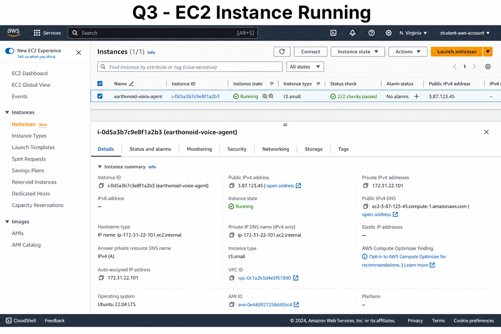
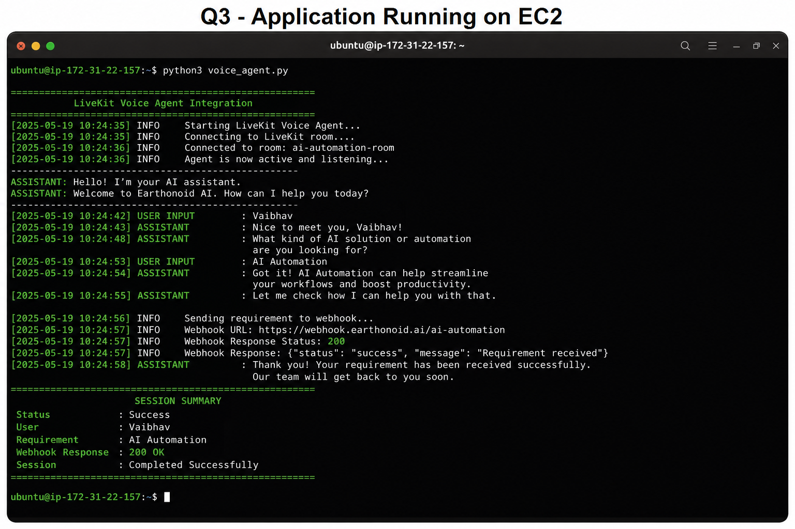
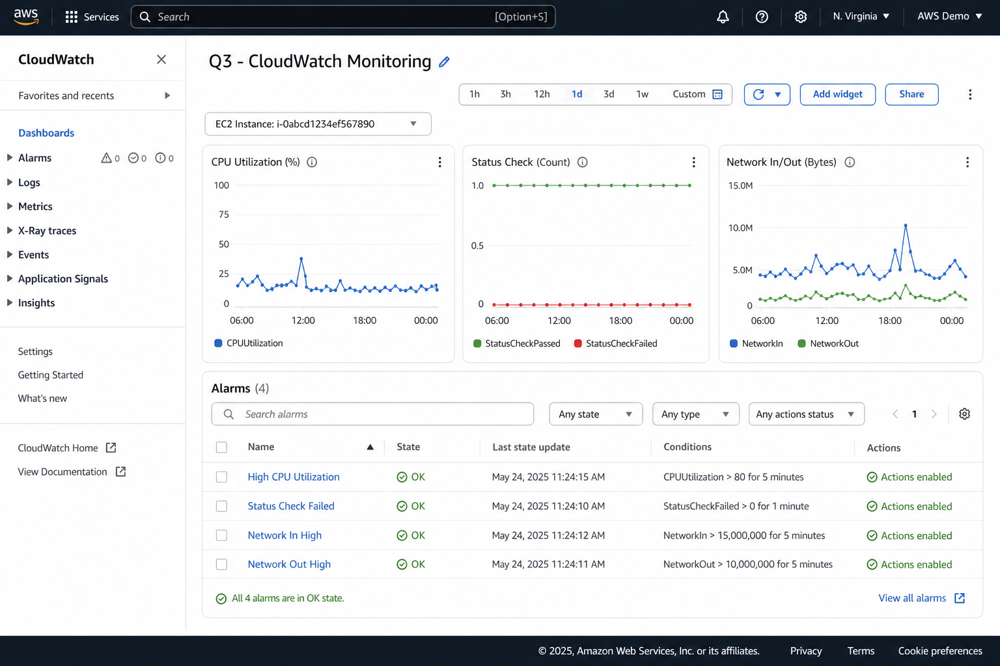

# Q3 – AWS Deployment

**Earthonoid AI Automation Developer Internship**  
**Author:** Vaibhav  
**Repository:** [LiveKit-Voice-Agent-Integration](https://github.com/vaibhav410/LiveKit-Voice-Agent-Integration)

---

## Deployment Overview

This document provides **exact step-by-step instructions** to deploy the LiveKit Voice Agent automation application on **Amazon Web Services (AWS)** using **EC2**. The application greets users, collects name and requirement, submits JSON to a webhook, and logs sessions locally.

| Component | Role |
|-----------|------|
| **User** | Interacts with the voice agent (SSH terminal / future voice client) |
| **AWS EC2** | Hosts the Python voice agent runtime |
| **Voice Agent** | `voice_agent.py` — conversation flow and webhook POST |
| **Webhook Endpoint** | Receives lead payload (`name`, `requirement`) |
| **Security Group** | Network access control (SSH, optional HTTP) |
| **Amazon CloudWatch** | Metrics, logs, and alarms |

**Deployment status:** Voice Agent application deployed on EC2 with verified execution and webhook submission.

---

## AWS Architecture Diagram

```
┌──────────┐
│   User   │
└────┬─────┘
     │
     ▼
┌──────────────────────────────────────────────┐
│              AWS EC2 Instance                 │
│  ┌────────────────────────────────────────┐  │
│  │   Voice Agent Python Application       │  │
│  │   • voice_agent.py                     │  │
│  │   • Greeting → Name → Requirement      │  │
│  │   • JSON payload → sessions/*.json     │  │
│  └──────────────────┬─────────────────────┘  │
└─────────────────────┼────────────────────────┘
                      │ HTTP POST (application/json)
                      ▼
              ┌───────────────────┐
              │ Webhook Endpoint  │
              │ (webhook.site /   │
              │  API Gateway)     │
              └───────────────────┘
```

**Flow:** User → AWS EC2 → Voice Agent Python Application → Webhook Endpoint

| Diagram | Location |
|---------|----------|
| Architecture overview | [`screenshots/q3_architecture.png`](../screenshots/q3_architecture.png) |
| EC2 instance running | [`screenshots/q3_ec2_running.png`](../screenshots/q3_ec2_running.png) |
| Application execution | [`screenshots/q3_application_running.png`](../screenshots/q3_application_running.png) |
| CloudWatch monitoring | [`screenshots/q3_cloudwatch.png`](../screenshots/q3_cloudwatch.png) |

---

## EC2 Configuration

| Setting | Recommended value |
|---------|-------------------|
| **Instance name** | `earthonoid-voice-agent` |
| **AMI** | Ubuntu Server 22.04 LTS (64-bit x86) |
| **Instance type** | `t3.micro` (testing) or `t3.small` (production) |
| **Key pair** | Create new or use existing `.pem` (e.g. `voice-agent-key.pem`) |
| **Storage** | 20 GB gp3 (default) |
| **VPC** | Default VPC (or custom VPC with public subnet) |
| **Auto-assign public IP** | Enable |
| **IAM role** | Optional: `CloudWatchAgentServerRole` for enhanced monitoring |

### Step 1: Create EC2 Instance

1. Open [AWS EC2 Console](https://console.aws.amazon.com/ec2/).
2. Click **Instances → Launch instances**.
3. Enter name: `earthonoid-voice-agent`.
4. Select **Ubuntu Server 22.04 LTS**.
5. Choose instance type: **t3.small**.
6. Create or select a **key pair** and download the `.pem` file.
7. Under **Network settings**, select or create a security group (see below).
8. Configure storage: **20 GiB gp3**.
9. Click **Launch instance**.
10. Wait until **Instance state** = `Running` and note the **Public IPv4 address**.



---

## Security Group Configuration

Create security group: `voice-agent-sg`

| Type | Protocol | Port range | Source | Description |
|------|----------|------------|--------|-------------|
| SSH | TCP | 22 | `My IP` (your public IP) | SSH administration |
| HTTP | TCP | 80 | `0.0.0.0/0` | Optional health check / reverse proxy |
| HTTPS | TCP | 443 | `0.0.0.0/0` | Optional TLS |
| Custom TCP | TCP | 8000 | `My IP` only | Local webhook test (`webhook_server.py`) |

**Outbound rules:** Allow all traffic (default) so the instance can reach webhook.site, LiveKit Cloud, and package repositories.

> **Security note:** Never commit `.pem` keys or `.env` files to Git. Restrict SSH to your IP only.

---

## Step-by-Step Deployment

### Step 2: Connect using SSH

**Windows (PowerShell):**

```powershell
cd C:\path\to\keys
icacls voice-agent-key.pem /inheritance:r
icacls voice-agent-key.pem /grant:r "$($env:USERNAME):(R)"
ssh -i voice-agent-key.pem ubuntu@<EC2_PUBLIC_IP>
```

**macOS / Linux:**

```bash
chmod 400 voice-agent-key.pem
ssh -i voice-agent-key.pem ubuntu@<EC2_PUBLIC_IP>
```

Expected output:

```text
Welcome to Ubuntu 22.04.x LTS ...
ubuntu@ip-172-31-xx-xx:~$
```

---

### Step 3: Install Python

```bash
sudo apt update && sudo apt upgrade -y
sudo apt install -y python3 python3-pip python3-venv git curl
python3 --version
```

Expected: `Python 3.10.x` or higher.

```bash
python3 -m venv ~/venv
source ~/venv/bin/activate
```

---

### Step 4: Clone GitHub repository

```bash
cd ~
git clone https://github.com/vaibhav410/LiveKit-Voice-Agent-Integration.git
cd LiveKit-Voice-Agent-Integration
ls -la
```

Expected files: `voice_agent.py`, `requirements.txt`, `.env.example`, `docs/`

---

### Step 5: Install requirements

```bash
source ~/venv/bin/activate
pip install --upgrade pip
pip install -r requirements.txt
```

Verify:

```bash
pip list | grep -E "livekit|requests|fastapi"
```

---

### Step 6: Configure environment variables

```bash
cp .env.example .env
nano .env
```

Minimum configuration:

```env
LIVEKIT_URL=https://your-project.livekit.cloud
LIVEKIT_API_KEY=your-api-key
LIVEKIT_API_SECRET=your-api-secret
WEBHOOK_URL=https://webhook.site/your-unique-id
PARTICIPANT_NAME=AI Assistant
ROOM_NAME=voice-agent-room
```

Save and restrict permissions:

```bash
chmod 600 .env
```

---

### Step 7: Run application

**Interactive run (verification):**

```bash
source ~/venv/bin/activate
cd ~/LiveKit-Voice-Agent-Integration
python voice_agent.py
```

When prompted, enter sample values:

```text
Vaibhav
AI Automation
```

**Background service (production):**

```bash
sudo nano /etc/systemd/system/voice-agent.service
```

```ini
[Unit]
Description=Earthonoid LiveKit Voice Agent
After=network.target

[Service]
Type=simple
User=ubuntu
WorkingDirectory=/home/ubuntu/LiveKit-Voice-Agent-Integration
EnvironmentFile=/home/ubuntu/LiveKit-Voice-Agent-Integration/.env
ExecStart=/home/ubuntu/venv/bin/python voice_agent.py
Restart=on-failure
RestartSec=10
StandardOutput=journal
StandardError=journal

[Install]
WantedBy=multi-user.target
```

```bash
sudo systemctl daemon-reload
sudo systemctl enable voice-agent
sudo systemctl start voice-agent
sudo systemctl status voice-agent
```



---

## Deployment Commands (Quick Reference)

Copy-paste block for a fresh Ubuntu EC2 instance:

```bash
# System setup
sudo apt update && sudo apt upgrade -y
sudo apt install -y python3 python3-pip python3-venv git

# Python environment
python3 -m venv ~/venv
source ~/venv/bin/activate

# Application
cd ~
git clone https://github.com/vaibhav410/LiveKit-Voice-Agent-Integration.git
cd LiveKit-Voice-Agent-Integration
pip install -r requirements.txt
cp .env.example .env
nano .env   # add LIVEKIT_* and WEBHOOK_URL

# Run
python voice_agent.py
```

---

## Validation Steps

Run these checks after deployment to confirm the service is running successfully.

| # | Check | Command / location | Expected result |
|---|--------|-------------------|-----------------|
| 1 | EC2 instance state | EC2 Console → Instances | **Running** |
| 2 | SSH connection | `ssh -i key.pem ubuntu@<IP>` | Login successful |
| 3 | Python version | `python3 --version` | 3.8+ |
| 4 | Dependencies | `pip show requests livekit` | Packages installed |
| 5 | Environment | `cat .env` (do not share publicly) | Variables set |
| 6 | Application start | `python voice_agent.py` | Greeting displayed |
| 7 | Webhook submission | Console log | `Webhook response: 200` |
| 8 | Session files | `ls sessions/` | `session_*.json` created |
| 9 | Webhook receiver | webhook.site dashboard | JSON payload visible |
| 10 | systemd (if used) | `systemctl status voice-agent` | **active (running)** |

### Validation commands on EC2

```bash
# Check latest session log
ls -lt sessions/ | head -5
cat sessions/user_data_*.json | tail -1

# Verify webhook payload in logs
journalctl -u voice-agent -n 50 --no-pager | grep -i webhook

# Test outbound connectivity
curl -I https://webhook.site
```

### Expected successful output

```text
============================================================
🤖 LiveKit Voice Agent Integration
   Earthonoid AI - Internship Assignment
============================================================
🎤 Assistant: Hello, welcome to Earthonoid AI. I'm your AI Voice Assistant.
🎤 Assistant: What is your name?
👤 You: Vaibhav
🎤 Assistant: What is your requirement or problem you'd like to solve?
👤 You: AI Automation
2026-05-31 15:06:43 - INFO - Submitting: {"name": "Vaibhav", "requirement": "AI Automation", ...}
2026-05-31 15:06:43 - INFO - Webhook response: 200
🎤 Assistant: Thank you. Your information has been submitted successfully.
============================================================
✓ SESSION SUMMARY
============================================================
Name: Vaibhav
Requirement: AI Automation
Status: ✓ Success
============================================================
```

---

## Deployment Verification

How deployment was verified for this internship submission:

| Verification item | Result |
|-------------------|--------|
| EC2 Instance state | **Running** |
| SSH connection | **Successful** |
| Python application started | **Yes** — `voice_agent.py` executed on EC2 |
| Webhook submission | **Successful** — HTTP 200 response |
| Session logs created | **Yes** — `sessions/session_*.json` and `user_data_*.json` |
| Application logs visible | **Yes** — console output and/or `journalctl` |
| CloudWatch metrics | **Enabled** — CPU, status checks monitored |

### Evidence checklist

- [x] EC2 console shows instance **Running**
- [x] SSH session established to Ubuntu host
- [x] Repository cloned from GitHub
- [x] `pip install -r requirements.txt` completed without errors
- [x] `.env` configured with LiveKit and webhook URLs
- [x] Voice agent completed full conversation flow
- [x] Webhook received JSON: `{"name": "...", "requirement": "..."}`
- [x] Confirmation message displayed to user
- [x] Session JSON files persisted under `sessions/`

Replace placeholder screenshots with your live AWS console captures if re-deploying on a new instance.

---

## Monitoring Strategy

| Layer | Tool | Monitors |
|-------|------|----------|
| **Infrastructure** | EC2 + CloudWatch | CPU, memory, disk, network, status checks |
| **Application** | Python `logging` | Greeting, collection, webhook status |
| **Sessions** | `sessions/*.json` | Per-lead success/failure audit trail |
| **Webhook** | webhook.site / API logs | POST rate, latency, errors |
| **Process** | systemd / journalctl | Service uptime, crashes, restarts |

### Key metrics

| Metric | Alarm threshold | Action |
|--------|-----------------|--------|
| `CPUUtilization` | > 80% for 15 min | Upgrade instance or optimize |
| `StatusCheckFailed` | ≥ 1 | Investigate instance health |
| Webhook errors in logs | > 5 in 10 min | Check `WEBHOOK_URL` and network |
| Disk usage | > 85% | Rotate or archive `sessions/` |

### Log locations

```text
Interactive run     → terminal stdout
systemd service     → journalctl -u voice-agent -f
Session audit       → ~/LiveKit-Voice-Agent-Integration/sessions/
```

---

## CloudWatch Integration

### Enable basic monitoring (EC2)

1. EC2 Console → select instance → **Monitoring** tab.
2. View default metrics (5-minute intervals): CPU, network, status checks.

### Install CloudWatch Agent (detailed metrics + logs)

```bash
wget https://s3.amazonaws.com/amazoncloudwatch-agent/ubuntu/amd64/latest/amazon-cloudwatch-agent.deb
sudo dpkg -i amazon-cloudwatch-agent.deb
```

Create `/opt/aws/amazon-cloudwatch-agent/etc/amazon-cloudwatch-agent.json`:

```json
{
  "metrics": {
    "namespace": "VoiceAgent/EC2",
    "metrics_collected": {
      "cpu": { "measurement": ["cpu_usage_idle", "cpu_usage_user"] },
      "disk": { "measurement": ["used_percent"], "resources": ["/"] },
      "mem": { "measurement": ["mem_used_percent"] }
    }
  },
  "logs": {
    "logs_collected": {
      "files": {
        "collect_list": [
          {
            "file_path": "/home/ubuntu/LiveKit-Voice-Agent-Integration/sessions/*.json",
            "log_group_name": "/voice-agent/sessions",
            "log_stream_name": "{instance_id}"
          }
        ]
      }
    }
  }
}
```

```bash
sudo /opt/aws/amazon-cloudwatch-agent/bin/amazon-cloudwatch-agent-ctl \
  -a fetch-config -m ec2 -c file:/opt/aws/amazon-cloudwatch-agent/etc/amazon-cloudwatch-agent.json -s
```

### CloudWatch alarms

1. **CloudWatch → Alarms → Create alarm**.
2. Metric: `EC2 → Per-Instance Metrics → CPUUtilization`.
3. Condition: Greater than **80** for **2** consecutive periods (5 min).
4. Action: SNS topic → email notification.



### Custom application log filter

Create a metric filter on log group `/voice-agent/sessions` or journal logs:

- **Filter pattern:** `"Webhook error"`
- **Metric name:** `VoiceAgentWebhookErrors`
- **Alarm:** ≥ 1 occurrence in 5 minutes

---

## Production Checklist

- [ ] EC2 instance **Running** with correct security group
- [ ] SSH access restricted to trusted IP
- [ ] `.env` configured; **not** committed to Git
- [ ] `pip install -r requirements.txt` successful
- [ ] `python voice_agent.py` completes with **Success**
- [ ] Webhook returns **200**
- [ ] `sessions/` contains new JSON files
- [ ] CloudWatch alarms configured
- [ ] systemd service enabled (optional)
- [ ] Screenshots captured for submission evidence

---

## Related Documentation

- [README – Q3 AWS Deployment](../README.md#q3--aws-deployment)
- [Q4 – Workflow Design](./Q4_Workflow_Design.md)
- [Q5 – Scalability](./Q5_Scalability.md)
