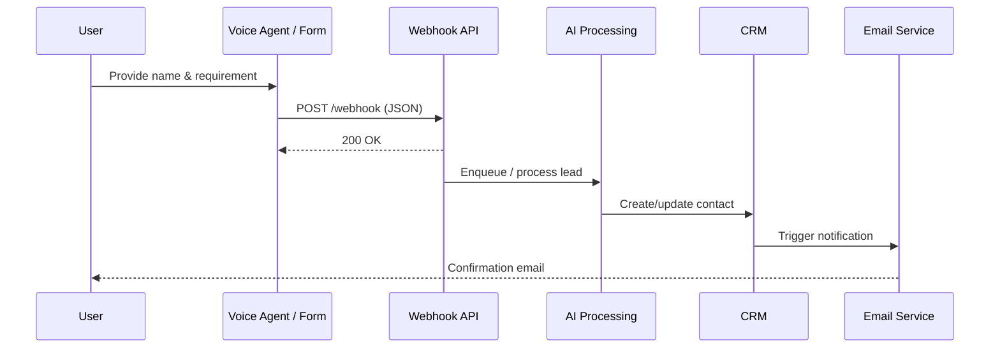

# Q4 – API & Workflow Design

**Earthonoid AI Automation Developer Internship**  
**Author:** Vaibhav | **Repository:** [LiveKit-Voice-Agent-Integration](https://github.com/vaibhav410/LiveKit-Voice-Agent-Integration)

---

## Workflow Architecture

End-to-end lead capture and processing pipeline for Earthonoid AI:

```
┌──────────────┐     ┌──────────┐     ┌─────────────────────┐     ┌─────┐     ┌──────────────────┐
│ Website Form │ ──► │ Webhook  │ ──► │ AI Processing Layer │ ──► │ CRM │ ──► │ Email Notification│
└──────────────┘     └──────────┘     └─────────────────────┘     └─────┘     └──────────────────┘
```

The **LiveKit Voice Agent** (Q2) acts as an alternative entry point to the same webhook, replacing the website form with a voice-driven conversation while producing an identical JSON payload structure.

See: [`screenshots/q4_workflow.png`](../screenshots/q4_workflow.png)

---

## Workflow Description

| Step | Component | Action |
|------|-----------|--------|
| 1 | **Website Form / Voice Agent** | User submits name and requirement (form fields or spoken input) |
| 2 | **Webhook** | Receives HTTP POST with JSON body; validates schema |
| 3 | **AI Processing Layer** | Classifies requirement, scores lead priority, enriches metadata |
| 4 | **CRM** | Creates or updates contact/deal (HubSpot, Salesforce, Zoho, etc.) |
| 5 | **Email Notification** | Sends confirmation to user and alert to sales team |

### Voice agent integration (this repository)

The voice agent implements steps 1–2 directly:

1. Greet user → collect name → collect requirement  
2. Build JSON payload → `POST` to `WEBHOOK_URL`  
3. Confirm submission → save session log  

Downstream steps (AI layer, CRM, email) are designed in this document and implemented via webhook consumers in production.

---

## API Flow

### Sequence diagram



### HTTP contract

| Property | Value |
|----------|--------|
| **Method** | `POST` |
| **Content-Type** | `application/json` |
| **Success codes** | `200`, `201`, `202` |
| **Timeout** | 10 seconds (configurable in `voice_agent.py`) |

---

## Sample JSON Payload

### Minimum payload (assessment requirement)

```json
{
  "name": "Vaibhav",
  "requirement": "AI Automation"
}
```

### Production payload (implemented in this project)

```json
{
  "name": "Vaibhav",
  "requirement": "AI Automation",
  "timestamp": "2026-05-31T15:06:43.093834"
}
```

### Extended payload (recommended for CRM)

```json
{
  "name": "Vaibhav",
  "requirement": "AI Automation",
  "timestamp": "2026-05-31T15:06:43.093834",
  "source": "voice_agent",
  "session_id": "20260531_150643",
  "priority_score": 0.87,
  "tags": ["ai-automation", "inbound-lead"]
}
```

---

## CRM Integration

| Approach | Description |
|----------|-------------|
| **Direct API** | Webhook handler calls HubSpot/Salesforce REST API on each lead |
| **Middleware** | Zapier, Make.com, or n8n maps webhook → CRM field mapping |
| **Queue worker** | Async worker consumes queue messages and upserts CRM records (see Q5) |

### Field mapping example

| Webhook field | CRM field |
|---------------|-----------|
| `name` | `contact.firstname` + `contact.lastname` |
| `requirement` | `deal.description` or custom property |
| `timestamp` | `created_at` |
| `source` | `lead_source` = `voice_agent` |

### Idempotency

Use `session_id` or a hash of `(name + requirement + date)` as an **idempotency key** to prevent duplicate CRM entries on webhook retries.

---

## Retry Logic

| Scenario | Strategy |
|----------|----------|
| **Transient network error** | Exponential backoff: 1s → 2s → 4s (max 3 attempts) |
| **HTTP 5xx from webhook** | Retry with backoff; dead-letter after max attempts |
| **HTTP 4xx (client error)** | Do not retry; log and alert (invalid payload) |
| **Timeout** | Treat as failure; retry once, then queue for manual review |

### Pseudocode

```python
for attempt in range(3):
    response = requests.post(WEBHOOK_URL, json=payload, timeout=10)
    if response.status_code in (200, 201, 202):
        return True
    if 400 <= response.status_code < 500:
        break
    time.sleep(2 ** attempt)
return False
```

The voice agent (`voice_agent.py`) performs a single attempt; production deployments should wrap the webhook call in a queue-based retry worker (Q5).

---

## Error Handling Strategy

| Error type | Detection | Response |
|------------|-----------|----------|
| Missing name/requirement | Input validation | Reprompt user; do not submit |
| Webhook unreachable | `requests.exceptions.ConnectionError` | User message + failed session log |
| Timeout | `requests.exceptions.Timeout` | Retry or queue; log `webhook.submission_success: false` |
| Invalid JSON response | Parse error on response | Log raw body; alert ops team |
| CRM failure | Downstream 5xx | Queue for retry; do not lose lead data |

### Session logging on failure

Failed submissions are persisted in `sessions/session_*.json` with `"status": "failed"` so leads can be recovered manually.

---

## Monitoring Strategy

| Metric | Tool | Threshold / action |
|--------|------|---------------------|
| Webhook success rate | CloudWatch / Datadog | Alert if < 95% over 15 min |
| End-to-end latency | APM trace | Alert if p95 > 5s |
| CRM sync failures | Custom counter | Page on-call if > 10/hour |
| Queue depth | SQS CloudWatch | Scale workers if depth > 100 |
| Email bounce rate | SES metrics | Review template / addresses |

### Structured logging format

```json
{
  "event": "lead_submitted",
  "name": "Vaibhav",
  "requirement": "AI Automation",
  "webhook_status": 200,
  "duration_ms": 342
}
```

---

## Related Documentation

- [Q2 – Voice Agent](../README.md#q2--livekit-voice-agent-integration)
- [Q3 – AWS Deployment](./Q3_AWS_Deployment.md)
- [Q5 – Scalability](./Q5_Scalability.md)
